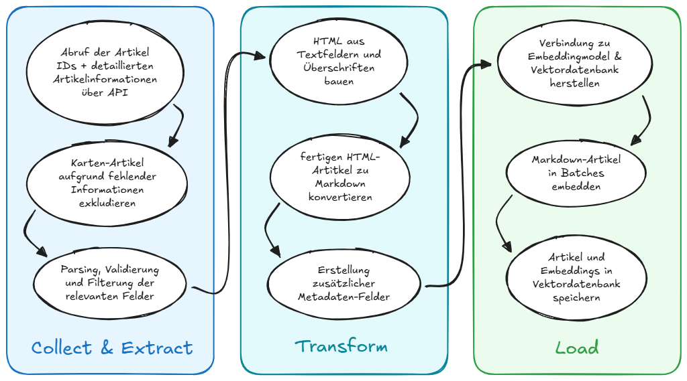
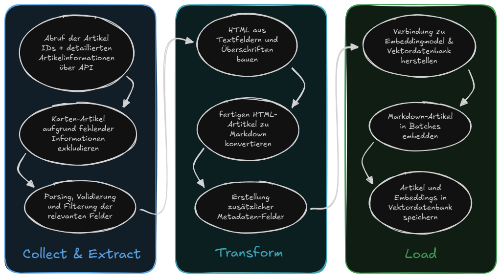

# Indizierungspipeline

Der Indexer ist eine Batch-Anwendung. Seine `app.py` steuert Collection-Builder, das Laden der Vektoren und die optionale Anreicherung mit Analysedaten. Nach einem Durchlauf beendet sich der Prozess und eignet sich daher für einen zeitgesteuerten Job.

## Pipeline-Stufen

### 1. Zielsystem prüfen

Vor dem Abruf externer Inhalte verlangt der Prozess `QDRANT_URL` und `QDRANT_API_KEY` und prüft die Verbindung. Bei einem Fehler endet er frühzeitig mit einem Rückgabewert ungleich null.

### 2. Quelldokumente sammeln

`VDB_COLLECTIONS` wählt die registrierten Builder aus; Standard ist `service,info`.

| Collection | Quelle                        | Verarbeitung                                                                        |
| ---------- | ----------------------------- | ----------------------------------------------------------------------------------- |
| `service`  | Münchner Dienstleistungs-APIs | IDs sammeln, Detailartikel laden, validieren und strukturierte Felder normalisieren |
| `info`     | Magnolia-Such-API             | Informationsseiten abrufen und direkt in LangChain-Dokumente umwandeln              |

Der Service-Builder erzwingt `DLF_INDEXER_MIN_ARTICLES` mit dem Standardwert `800`. Diese Sicherung verhindert, dass eine intakte Collection durch eine offensichtlich unvollständige Antwort des Quellsystems ersetzt wird.

### 3. Inhalte transformieren

Dienstleistungsartikel werden aus strukturierten Feldern und eingebettetem HTML in Markdown umgewandelt. Der Transformer:

- ordnet deutsche und englische Quellfeld-IDs lesbaren Überschriften zu;
- extrahiert Zusammenfassungen, Beschreibungen, Voraussetzungen, Gebühren, Rechtsgrundlagen, Links und Onlinedienste;
- erhält Metadaten wie Name, Quell-URL, Schlagwörter, Kategorien und Sprache;
- erzeugt eine stabile UUIDv5 aus der öffentlichen Dienstleistungs-ID.

Stabile IDs sind die Grundlage inkrementeller Aktualisierungen und sorgen bei wiederholten Läufen für eine gleichbleibende Dokumentidentität.

### 4. Embeddings erzeugen und laden

Jedes Dokument erhält:

- einen dichten Vektor aus `OPENAI_EMBEDDING_MODEL`;
- einen deutschen Sparse-Vektor aus `EMB_SPARSE_MODEL` (Standard `Qdrant/bm25`);
- Seiteninhalt und Metadaten als Qdrant-Payload.

Vor dem Schreiben in eine vorhandene Collection legt der Loader einen Snapshot an und entfernt alte Snapshots oberhalb von `VDB_MAX_SNAPSHOTS`. Er bildet Hashes über normalisierte Dokumentinhalte, überspringt unveränderte Points, aktualisiert geänderte stabile IDs und fügt neue Dokumente in Batches der Größe `VDB_BATCH_SIZE` ein.

Mit `VDB_DEL_COLLECTION=true` wird die vorhandene Collection vollständig ersetzt. Der standardmäßige inkrementelle Modus ist sicherer und verhindert, dass unveränderte Inhalte erneut eingebettet werden.

### 5. Popularitätsdaten ergänzen

Sind `ETRACKER_URL_BASE` und `ETRACKER_TOKEN` gesetzt, verknüpft die letzte Stufe Besuchszahlen mit indizierten URLs und aktualisiert Qdrant-Payloads. Der authentifizierte Abruf von Dienstleistungs-IDs verwendet `API_AUTH_USER` und `API_AUTH_PASS`. Ohne das Analytics-Paar wird die Anreicherung protokolliert übersprungen und der Indizierungslauf nicht als fehlgeschlagen bewertet.

## Wesentliche Konfiguration

| Variable                   | Standard       | Bedeutung                                         |
| -------------------------- | -------------- | ------------------------------------------------- |
| `VDB_COLLECTIONS`          | `service,info` | Builder und Ziel-Collections                      |
| `OPENAI_EMBEDDING_MODEL`   | keiner         | Erforderliches dichtes Embedding-Modell           |
| `EMB_SPARSE_MODEL`         | `Qdrant/bm25`  | Sparse-Embedding-Modell                           |
| `VDB_DENSE_VECTOR_NAME`    | `dense`        | Name des dichten Vektors in Qdrant                |
| `VDB_SPARSE_VECTOR_NAME`   | `sparse`       | Name des Sparse-Vektors in Qdrant                 |
| `VDB_BATCH_SIZE`           | `25`           | Dokumente pro Upsert-Batch                        |
| `VDB_MAX_SNAPSHOTS`        | `10`           | Aufbewahrte Snapshots je Collection               |
| `DLF_INDEXER_MIN_ARTICLES` | `800`          | Mindestanzahl akzeptierter Dienstleistungsartikel |

## Fehlerverhalten und Wiederherstellung

Collection-Builder sind voneinander isoliert: Schlägt ein Builder fehl, wird dies protokolliert und die übrigen konfigurierten Builder können weiterlaufen. Fehler bei Upserts protokollieren die betroffenen Dokumente und pausieren vor der Fortsetzung. Snapshots bieten einen Wiederherstellungspunkt in Qdrant; das Wiederherstellen selbst ist eine Betriebsaufgabe.

Sicherer Ablauf eines Produktionslaufs:

1. Endpunkte und Zugangsdaten der Quellsysteme prüfen.
2. Übereinstimmung der Embedding-Konfiguration mit dem Core prüfen.
3. Indexer ausführen und Collection-Größen sowie Logs kontrollieren.
4. Health-Endpunkt des Core und repräsentative Suchanfragen testen.
5. Den neuesten bekanntermaßen funktionierenden Snapshot bis zum Abschluss der Prüfung behalten.
