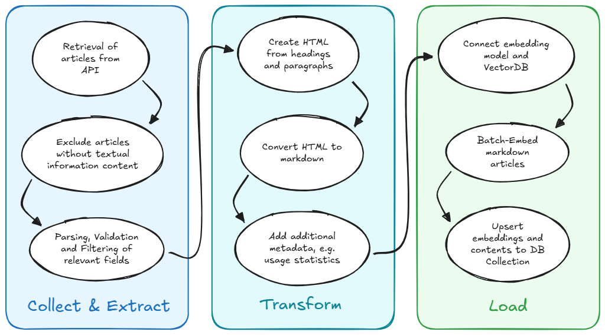
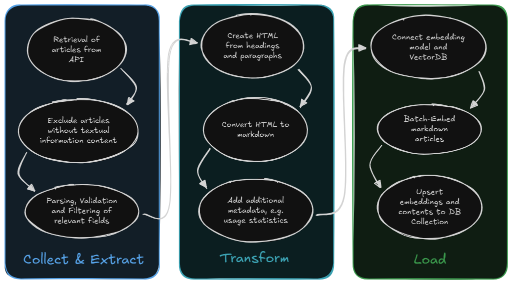

# Indexing pipeline

The indexer is a batch application whose `app.py` orchestrates collection builders, vector loading, and optional analytics enrichment. It exits after one run and is suited to a scheduled job.

## Pipeline stages

### 1. Validate the target

Before external collection starts, the process requires `QDRANT_URL` and `QDRANT_API_KEY` and verifies the connection. A failed validation returns a non-zero exit code early.

### 2. Collect source documents

`VDB_COLLECTIONS` selects registered builders; the default is `service,info`.

| Collection | Source | Processing |
| --- | --- | --- |
| `service` | Munich service APIs | Collect IDs, fetch detailed articles, validate, and normalize structured fields |
| `info` | Magnolia search API | Fetch information pages and convert them directly to LangChain documents |

The service builder enforces `DLF_INDEXER_MIN_ARTICLES` (default `800`) as a safety guard against replacing a healthy index with a suspiciously incomplete upstream response.

### 3. Transform content

Service articles are converted from structured fields and embedded HTML into Markdown. The transformer:

- maps German and English source field IDs to readable headings;
- extracts summaries, descriptions, prerequisites, fees, legal bases, links, and online services;
- retains metadata such as name, source URL, keywords, categories, and language;
- generates a stable UUIDv5 from the public service identifier.

Stable IDs are central to incremental updates and make repeated runs idempotent at the document identity level.

### 4. Embed and load

Each document receives:

- a dense vector from `OPENAI_EMBEDDING_MODEL`;
- a German sparse vector from `EMB_SPARSE_MODEL` (default `Qdrant/bm25`);
- its page content and metadata as Qdrant payload.

Before writing an existing collection, the loader creates a snapshot and prunes old snapshots beyond `VDB_MAX_SNAPSHOTS`. It hashes normalized document content, skips unchanged points, updates modified stable IDs, and inserts new documents in `VDB_BATCH_SIZE` batches.

Setting `VDB_DEL_COLLECTION=true` replaces the existing collection. The default incremental mode is safer and avoids embedding unchanged content.

### 5. Enrich popularity

When both `ETRACKER_URL_BASE` and `ETRACKER_TOKEN` are configured, the final stage joins analytics visits to indexed URLs and updates Qdrant payloads. Authenticated service-ID retrieval uses `API_AUTH_USER` and `API_AUTH_PASS`. Without the analytics pair, enrichment is logged as skipped rather than failing the indexing run.

## Essential configuration

| Variable | Default | Meaning |
| --- | --- | --- |
| `VDB_COLLECTIONS` | `service,info` | Builders and target collection names |
| `OPENAI_EMBEDDING_MODEL` | none | Required dense embedding model |
| `EMB_SPARSE_MODEL` | `Qdrant/bm25` | Sparse embedding model |
| `VDB_DENSE_VECTOR_NAME` | `dense` | Dense vector slot in Qdrant |
| `VDB_SPARSE_VECTOR_NAME` | `sparse` | Sparse vector slot in Qdrant |
| `VDB_BATCH_SIZE` | `25` | Documents per upsert batch |
| `VDB_MAX_SNAPSHOTS` | `10` | Snapshots retained per collection |
| `DLF_INDEXER_MIN_ARTICLES` | `800` | Minimum accepted service-article count |

## Failure behavior and recovery

Collection builders are isolated: a failed builder is logged and the remaining configured builders can continue. Upsert failures log affected documents and pause before proceeding. Snapshots provide a Qdrant-side recovery point, but restoration is an operator action.

For a safe operational run:

1. Confirm upstream endpoints and credentials.
2. Confirm embedding parity with the core.
3. Run the indexer and inspect collection counts and logs.
4. Call the core health endpoint and test representative retrievals.
5. Retain the newest known-good snapshot until validation is complete.
